<!-- README.md is generated from README.Rmd. Please edit that file -->

# ICSClust

<!-- badges: start -->

[](https://github.com/AuroreAA/ICSClust/actions/workflows/R-CMD-check.yaml)
<!-- badges: end -->

The goal of `ICSClust` is to perform tandem clustering with invariant
coordinate selection.

## Installation

You can install the development version of ICSClust from
[GitHub](https://github.com/) with:

``` r
# install.packages("devtools")
devtools::install_github("AuroreAA/ICSClust")
```

## Example of ICS and some plots

``` r
library(ICSClust)
#> Loading required package: ICS
#> Loading required package: mvtnorm
#> Loading required package: ggplot2
#> Registered S3 method overwritten by 'GGally':
#>   method from   
#>   +.gg   ggplot2

# import data
X <- iris[,-5]

# run ICS
ICS_out <- ICS(X)
summary(ICS_out)
#> 
#> ICS based on two scatter matrices
#> S1: COV
#> S2: COV4
#> 
#> Information on the algorithm:
#> QR: TRUE
#> whiten: FALSE
#> center: FALSE
#> fix_signs: scores
#> 
#> The generalized kurtosis measures of the components are:
#>   IC.1   IC.2   IC.3   IC.4 
#> 1.2074 1.0269 0.9292 0.7405 
#> 
#> The coefficient matrix of the linear transformation is:
#>      Sepal.Length Sepal.Width Petal.Length Petal.Width
#> IC.1     -0.52335      1.9933       2.3731     -4.4308
#> IC.2      0.83296      1.3275      -1.2666      2.7900
#> IC.3      3.05683     -2.2269      -1.6354      0.3654
#> IC.4      0.05244      0.6032      -0.3483     -0.3798

# Pot of generalized eigenvalues
select_plot(ICS_out)
```

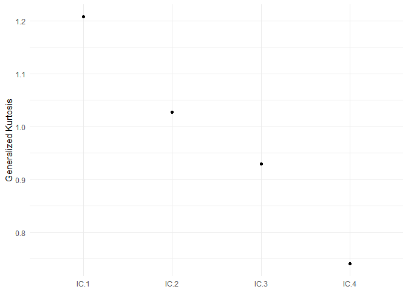

``` r
select_plot(ICS_out, type = "lines")
```

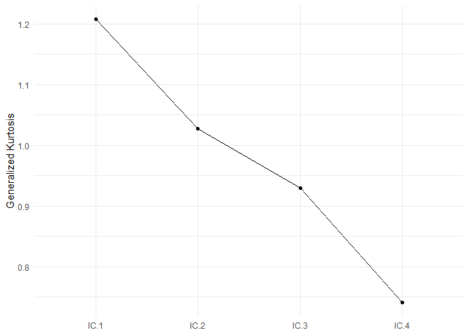

``` r

# pairs of all components
component_plot(ICS_out)
```

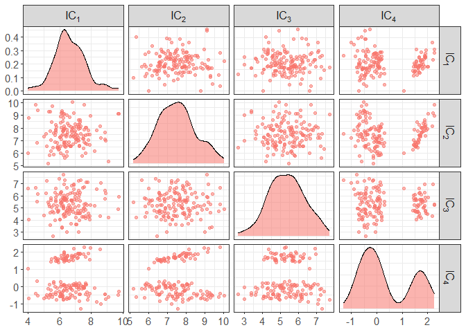

``` r
# pairs of only a the first and fourth components
component_plot(ICS_out, select = c(1,4))
```

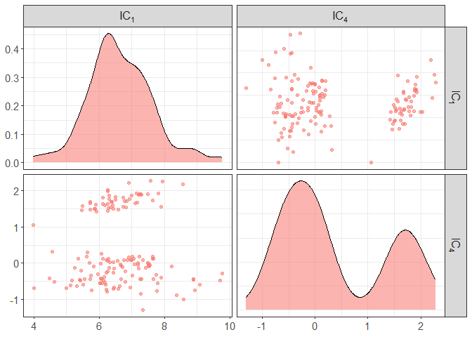

``` r
# add some colors by clusters
component_plot(ICS_out, clusters = iris[,5])
```

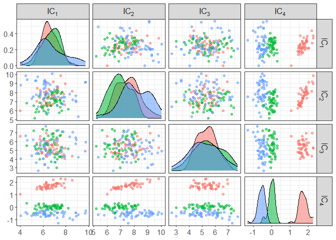

``` r
component_plot(ICS_out, select = c(1,4), clusters = iris[,5])
```

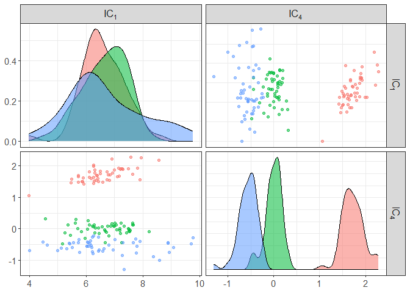

``` r

# in case you want to do it for initial data
component_plot(X, select = c(1,4), clusters = iris[,5])
```

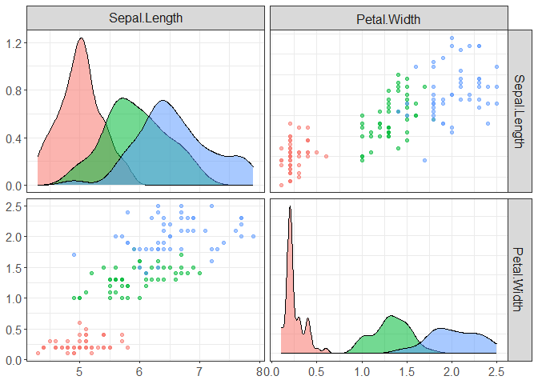

## Example of ICSClust

``` r

# ICSClust requires at least 2 arguments:
# - X: data
# - nb_clusters: nb of clusters
ICS_out <- ICSClust(X, nb_clusters = 3)
summary(ICS_out)
#> 
#> ICS based on two scatter matrices
#> S1: COV
#> S2: COV4
#> 
#> The generalized kurtosis measures of the components are:
#>   IC.1   IC.2   IC.3   IC.4 
#> 1.2074 1.0269 0.9292 0.7405 
#> 
#> The coefficient matrix of the linear transformation is:
#>      Sepal.Length Sepal.Width Petal.Length Petal.Width
#> IC.1     -0.52335      1.9933       2.3731     -4.4308
#> IC.2      0.83296      1.3275      -1.2666      2.7900
#> IC.3      3.05683     -2.2269      -1.6354      0.3654
#> IC.4      0.05244      0.6032      -0.3483     -0.3798
#> 
#>  3 components are selected: IC.4 IC.1 IC.2
#> 
#>  3 clusters are identified:
#> 
#>  1  2  3 
#> 38 62 50
plot(ICS_out)
```

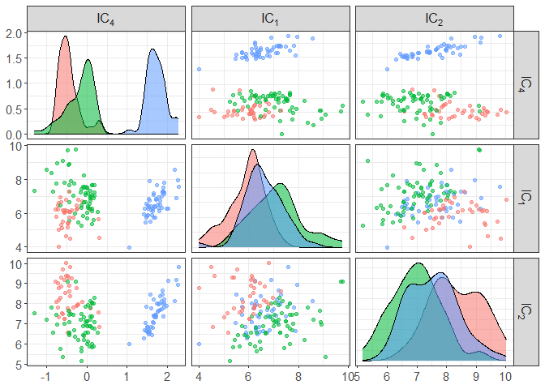

``` r

# You can also mention the number of invariant components to keep
ICS_out <- ICSClust(X, nb_select = 2, nb_clusters = 3)
# confusion table with initial clusters
table(ICS_out$clusters, iris[,5])
#>    
#>     setosa versicolor virginica
#>   1      0         25        19
#>   2     49          0         0
#>   3      1         25        31
component_plot(ICS_out$ICS_out, select = ICS_out$select, clusters = as.factor(ICS_out$clusters))
```

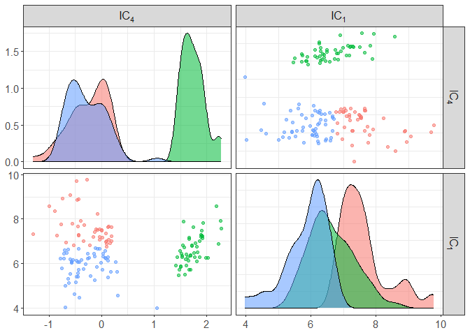

``` r

# to change the scatter pair
ICS_out <- ICSClust(X, nb_select = 1, nb_clusters = 3,
                ICS_args = list(S1 = ICS_mcd_raw, S2 = ICS_cov,
                                S1_args = list(alpha = 0.5)))
table(ICS_out$clusters, iris[,5])
#>    
#>     setosa versicolor virginica
#>   1      0          5        26
#>   2      0         45        24
#>   3     50          0         0
component_plot(ICS_out$ICS_out, clusters = as.factor(ICS_out$clusters))
```

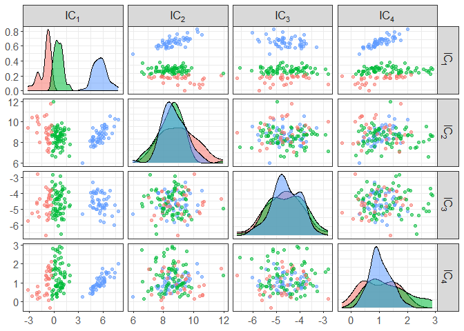

``` r


# to change the criteria to select the invariant components
ICS_out <- ICSClust(X, nb_clusters = 3,
                ICS_args = list(S1 = ICS_mcd_raw, S2 = ICS_cov,
                                S1_args = list(alpha = 0.5)),
                criterion = "normal_crit",
                ICS_crit_args = list(level = 0.1, test = "anscombe.test",
                                     max_select = NULL))

component_plot(ICS_out$ICS_out, select = ICS_out$select, clusters = as.factor(ICS_out$clusters))
```

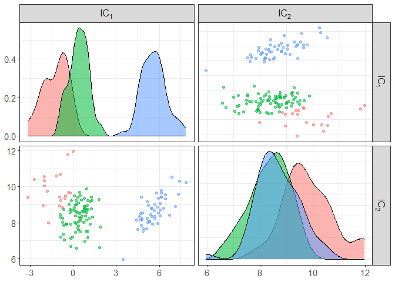

``` r


# to change the clustering method
ICS_out <- ICSClust(X, nb_select = 1, nb_clusters = 3,
                ICS_args = list(S1 = ICS_mcd_raw, S2 = ICS_cov,
                                S1_args = list(alpha = 0.5)),
                method  = "tkmeans_clust",
                clustering_args = list(alpha = 0.1))
table(ICS_out$clusters, iris[,5])
#>    
#>     setosa versicolor virginica
#>   0      7          0         8
#>   1      0         40        15
#>   2     43          0         0
#>   3      0         10        27
component_plot(ICS_out$ICS_out, clusters = as.factor(ICS_out$clusters))
```

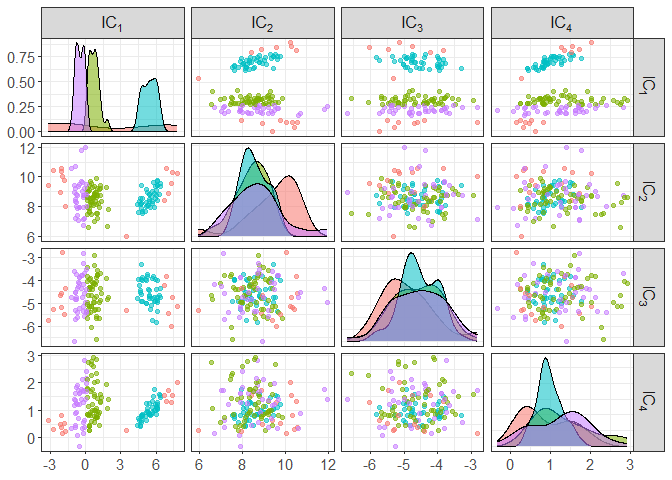
